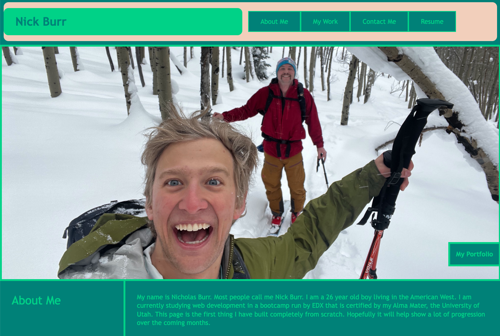

# Nicholas Burr's Web Development Portfolio

## Description
This is a working portfolio of the web development work of Nicholas Burr. This is the first web page created entirely by me, Nicholas Burr. My Motivation for this project is to document my web development learning journey. The goals of this project were to get comfortable with CSS and HTML. I applied a lot of flexbox skills learned in the bootcamp. I was able to solve responsiveness to different sized windows using flexbox as well as other CSS properties.

## Installation
N/A

## Usage
To use this page simply scroll and click on links as you would any normal web page.

## Credits
The Reset.css file was provided by the edx 2u bootcamps. Other than that all of the code is original and the work of Nicholas Burr. I did have some help with concepts from our TA Jacek Hacking, BCS tutor Trinh Nguyen, and BCS Learning Assitants: Mia, David, and Carlin, unfortunately I do not have access to their respective last names. 

## License
Refer to the License in the Repository.

